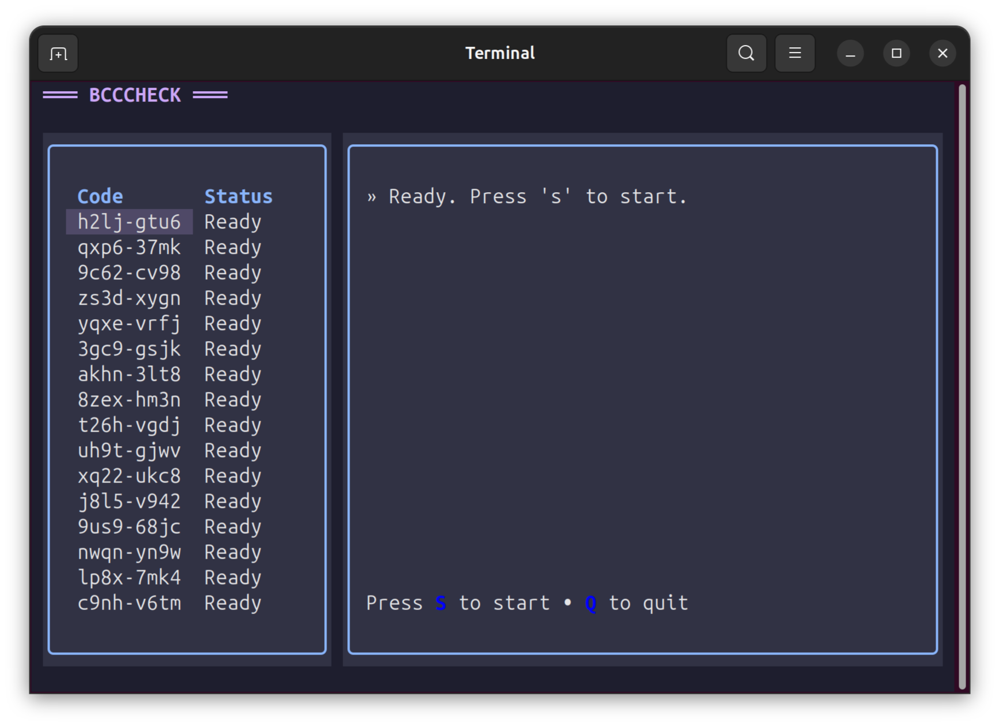

# bcccheck



A small, practical, open-source helper that automates checking Bandcamp YUM codes like a careful, efficient human.

bcccheck opens bandcamp.com/yum in a real browser session, enters codes from a list one at a time, and stops at the first redeemable code it finds. It features a modern, "New Retro" TUI (Terminal User Interface) for a beautiful and snappy experience.

> Example: You have a list of codes from a release. bcccheck loads the YUM page, types each code, and when one is redeemable, marks it in the TUI and stops.

---

## Features

- **Integrated TUI**: A beautiful terminal interface with a "Catppuccin Mocha" palette.
- **Automated Redemption**: Enters codes in a real browser session via Playwright.
- **Intelligent Detection**: Uses robust signals (navigation redirects or page metadata) to confirm success.
- **Human-like Pacing**: Small delays to mimic natural interaction and avoid rate limits.
- **Session Aware**: Works with your authenticated `cookies.json` for seamless redemption to your account.

---

## Requirements

- Python 3.9+
- Playwright (Python bindings)
- Textual (for the TUI)
- A codes list file: `codes.txt` (one code per line)
- Your Bandcamp cookies: `cookies.json` (optional, for authenticated sessions)

---

## Installation (Development)

1. Clone the repo
    ```sh
    git clone https://codeberg.org/your-user/bcccheck.git
    cd bcccheck
    ```

2. Create and activate a virtual environment
    ```sh
    python -m venv .venv
    source .venv/bin/activate
    ```

3. Install dependencies
    ```sh
    pip install -r requirements.txt
    ```

4. Install Playwright browser
    ```sh
    playwright install chromium
    ```

---

## Usage

### Run the TUI (Recommended)
This launches the modern terminal interface:

```sh
python tui.py
```
- Press **'s'** to start checking codes.
- Press **'q'** to quit.

### Run the CLI
For a classic, text-only experience:

```sh
python bcccheck.py
```

---

## Preparing `codes.txt`

Create a `codes.txt` file in the project root with one Bandcamp YUM code per line. Example:

```
abcd-1234
efgh-5678
qdxa-ktw6
```

---

## Authentication (`cookies.json`)

To redeem codes directly to your Bandcamp collection, export your cookies to `cookies.json` in the project root.

- Log in to Bandcamp in your browser.
- Use a cookie export extension (Netscape or JSON format).
- Save as `cookies.json`.

---

## Project structure

- `tui.py` — The TUI application entry point.
- `bcccheck.py` — The core logic and CLI entry point.
- `styles.tcss` — Stylesheet for the TUI (Catppuccin Mocha theme).
- `codes.txt` — Your list of codes (ignored by git).
- `cookies.json` — Your Bandcamp session cookies (ignored by git).

---

## Open Source

- License: MIT
- Contributions welcome!

Happy checking!
